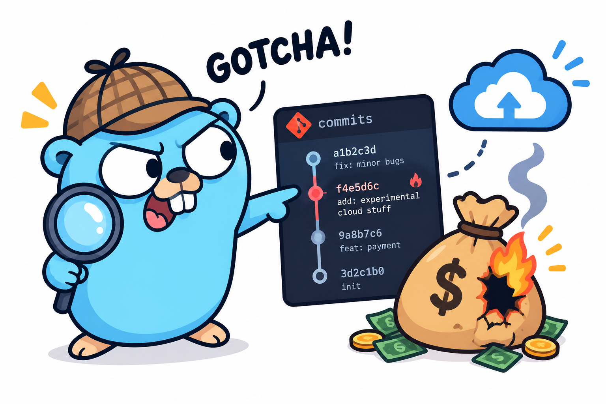

<div align="center">



# 💸 costblame

### `git blame`, but for your cloud bill.

**Every cost spike has a name on it. costblame finds it in seconds.**

[](https://go.dev)
[](LICENSE)
[](#faq)
[](#narratives-any-llm-or-none)
[](#architecture--the-guided-tour)

</div>

---

Your bill spiked at 3am. Somebody's deploy did it. `costblame` tells you **which deploy, which change, and whose name is on it** — with a confidence score and a plain-English explanation, delivered to your team before anyone opens a billing dashboard.

One self-hosted Go binary. It watches your cloud spend, listens to your CI/CD pipeline, and runs a multi-factor scoring engine that connects cost anomalies to the deployments most likely to have caused them. No SaaS. No agents on your hosts. No data leaving your infrastructure.

```
 you            : "why is the bill up 145%?"
 costblame      : "PR #847 by @alice — provisioned concurrency on the
                   payment function, deployed 6h before the spike.
                   Confidence 0.86. Here's the revert suggestion."
 time elapsed   : 4 seconds
 dashboards open: 0
```

---

## Table of Contents

- [The Problem](#the-problem)
- [How It Works](#how-it-works)
- [Bring Your Own Everything](#bring-your-own-everything)
- [Architecture — the Guided Tour](#architecture--the-guided-tour)
- [Confidence Scoring](#confidence-scoring)
- [Anatomy of a Blame](#anatomy-of-a-blame)
- [Use Cases](#use-cases)
- [Quickstart](#quickstart)
- [CLI Reference](#cli-reference)
- [Configuration](#configuration)
- [REST API](#rest-api)
- [Adapter Setup](#adapter-setup)
- [Extending costblame](#extending-costblame)
- [FAQ](#faq)
- [Testing](#testing) · [Technology Stack](#technology-stack) · [License](#license)

---

## The Problem

Cloud bills spike. Everyone has seen it: serverless invocations explode overnight, a compute fleet doubles, a database starts scanning instead of querying. You open your billing dashboard and see the spike. Then the investigation begins.

| | Without costblame | With costblame |
|---|---|---|
| **Detection** | Someone notices the bill — days later | Anomaly flagged on the next poll, minutes after billing data lands |
| **Investigation** | 30–90 min of cross-referencing deploy logs, Git history, billing dashboards | Automatic — scored candidates ranked by evidence |
| **The answer** | "Probably something we shipped last week?" | *"PR #847 by @alice, 6h before the spike, confidence 0.86"* |
| **The follow-up** | A meeting | A Slack message with a suggested fix, and a one-click confirm/dismiss |
| **Next time** | Start from scratch | Confirmed blames sharpen future scoring |

That investigation tax is paid on *every single spike*. `costblame` pays it once — in code.

---

## How It Works

Six steps, fully automatic:

1. **Polls your cloud billing API** on a configurable interval. For each service, it computes a rolling 30-day baseline (median and MAD, so past spikes don't hide new ones) and flags spend that is a robust z-score above 3.5 over it as an anomaly.
2. **Ingests deploy events** from your CI/CD via webhooks, enriching each one asynchronously with PR metadata and changed file paths.
3. **Scores every deployment** from the 72 hours before the anomalous cost period through the end of that period on four independent, explainable factors. The weighted sum is the confidence score — no black box.
4. **Generates a narrative** — a 2–3 sentence plain-English explanation of what spiked, what probably caused it, and what to do next. Uses your LLM if you configure one, clean templates if you don't. **An LLM is never required.**
5. **Alerts your team** through every notifier you've configured — chat, incident tooling, or any HTTP endpoint.
6. **Takes feedback** through a REST API and terminal UI: confirm a blame and future scoring gets sharper; dismiss it and the false positive is remembered.

---

## Bring Your Own Everything

`costblame` is built around four small Go interfaces. Every external system is an adapter — use the built-in ones, or write your own in an afternoon.

| Slot | Interface | Built-in adapters | Swap in |
|------|-----------|-------------------|---------|
| 💸 Billing source | `collect.CostSource` | AWS Cost Explorer | Any cloud or FinOps platform with a cost API |
| 🚀 Deploy events | `collect.DeploySource` | GitHub Actions · GitLab CI · ArgoCD | Any CI/CD that can send a webhook |
| 🧠 Narratives | `correlate.NarrativeGenerator` | Anthropic · OpenAI · Ollama (local) · any OpenAI-compatible endpoint · template fallback | Any LLM provider — or none |
| 📣 Alerts | `notify.Notifier` | Slack · generic outbound webhook | Anything that accepts an HTTP POST |

The correlation engine — the part that actually answers *"who did this?"* — depends only on these interfaces. It doesn't know or care which cloud, which CI, or which model you use.

### Filled in = switched on

You don't enumerate integrations anywhere — costblame inspects what's configured and acts accordingly. Every deploy source with a secret gets a webhook endpoint; every alert destination with credentials receives alerts; the LLM provider is auto-detected from whichever conventional env var is present:

```bash
GITHUB_WEBHOOK_SECRET=…   # → /webhooks/github goes live
GITLAB_WEBHOOK_SECRET=…   # → /webhooks/gitlab goes live
ANTHROPIC_API_KEY=…       # → narratives via the Anthropic API
OPENAI_API_KEY=…          # → …or via OpenAI
OLLAMA_HOST=…             # → …or via your local model. None set? Templates.
SLACK_BOT_TOKEN=…         # → alerts to Slack
```

That means a fully working deployment can be **zero YAML** — environment variables alone are enough.

---

## Architecture — the Guided Tour

The whole system is one process. Data flows top to bottom: the outside world feeds two collectors, everything meets in an embedded store, the correlation engine turns raw events into blame, and the results flow back out to humans and machines.

```
                       T H E   O U T S I D E   W O R L D

        cloud billing API                CI/CD pipelines          your team
       any provider with a          GitHub · GitLab · ArgoCD   chat · webhooks
     cost API (AWS built-in)         anything that can POST    API · terminal
                │                               │        (6) alerts & ▲
                │ (1) pull · every 15m          │ (2) push    answers │
                ▼                               ▼                     │
╔══════════════════════════════════════════════════════════════════════════════╗
║ COSTBLAME · one process · one binary · your infrastructure          ▲        ║
║                                                                     │        ║
║  ┌─────────────────────────┐  ┌──────────────────────────────┐      │        ║
║  │ COST COLLECTOR          │  │ DEPLOY RECEIVERS             │      │        ║
║  │ collect.CostSource      │  │ collect.DeploySource × N     │      │        ║
║  │                         │  │                              │      │        ║
║  │ · rolling 30-day        │  │ · POST /webhooks/<source>    │      │        ║
║  │   baseline per service  │  │ · signature check, then      │      │        ║
║  │ · robust z > 3.5 AND    │  │   202 Accepted in ~1 ms      │      │        ║
║  │   Δ ≥ 20%  ⇒  anomaly   │  │ · PR + changed files         │      │        ║
║  │                         │  │   enriched in background     │      │        ║
║  └────────────┬────────────┘  └───────────────┬──────────────┘      │        ║
║               │ CostSnapshot                  │ DeployEvent         │        ║
║               ▼                               ▼                     │        ║
║  ┌───────────────────────────────────────────────────────────┐      │        ║
║  │ (3) EMBEDDED STORE · SQLite · WAL · zero infra to operate │      │        ║
║  │                                                           │      │        ║
║  │      cost_snapshots ◄──── blame_edges ────► deploy_events │      │        ║
║  │               (the blame graph lives here)                │      │        ║
║  └─────────────────────────────┬─────────────────────────────┘      │        ║
║                                │ every poll tick                    │        ║
║                                ▼                                    │        ║
║  ┌───────────────────────────────────────────────────────────┐      │        ║
║  │ (4) CORRELATION ENGINE — answers "who did this?"          │      │        ║
║  │                                                           │      │        ║
║  │ for each anomaly nobody has blamed yet:                   │      │        ║
║  │   · collect every deploy from 72 h before → end of period │      │        ║
║  │   · score each (anomaly, deploy) pair on 4 factors:       │      │        ║
║  │       time 40% · service 30% · tags 20% · history 10%     │      │        ║
║  │   · <0.10 drop  ·  ≥0.10 keep as pending  ·  ≥0.65 act    │      │        ║
║  └─────────────────────────────┬─────────────────────────────┘      │        ║
║                                │ (5) high confidence ⇒ act          │        ║
║               ┌────────────────┴──────────────┐                     │        ║
║               ▼                               ▼                     │        ║
║  ┌─────────────────────────┐  ┌──────────────────────────────┐      │        ║
║  │ NARRATIVE GENERATOR     │  │ NOTIFIER FAN-OUT             │      │        ║
║  │ any LLM, hosted/local,  │─►│ notify.Notifier × N          │──────┤        ║
║  │ or template fallback    │  │ Slack · webhook · yours      │      │        ║
║  └─────────────────────────┘  └──────────────────────────────┘      │        ║
║                                                                     │        ║
║  ┌─────────────────────────────────────────────────────────────┐    │        ║
║  │ (6) REVIEW & FEEDBACK LOOP                                  │────┘        ║
║  │ REST API · /blame /anomalies /confirm /dismiss /healthz     │             ║
║  │ TUI · interactive blame timeline · costblame tui            │             ║
║  │                                                             │             ║
║  │ confirm ⇒ author+service history boosts future scores       │             ║
║  │ dismiss ⇒ false positive recorded, never re-alerted         │             ║
║  └─────────────────────────────────────────────────────────────┘             ║
╚══════════════════════════════════════════════════════════════════════════════╝
```

### ❶ The cost collector — *pull*

A `collect.CostSource` adapter polls your billing API on `cost.poll_interval` (default 15m). For every service it sees, it maintains a rolling 30-day baseline of daily spend (days with no billing count as zero). The baseline uses the **median and the median absolute deviation (MAD)** rather than the mean and standard deviation: a past spike does not inflate it and hide the next one, and a perfectly flat history still has a usable spread (a floor derived from `anomaly_min_delta_pct` and `zscore_threshold`, so a flat series is flagged as soon as it rises by the minimum delta, and at least `sigma_floor_usd`), so $5/day jumping to $500 is caught, and so is a steady $1,000/day service rising 25%. A reading is flagged as an anomaly only when **both** conditions hold: the robust z-score exceeds `zscore_threshold` (default 3.5, the conventional cut-off for MAD scores) *and* the relative increase beats `anomaly_min_delta_pct` (default 20%). The double condition matters — the z-score catches statistically unusual jumps, while the minimum delta filters out "statistically unusual but who cares" noise on near-zero services. Services with fewer than `min_history_days` days of spend (default 7) are still *learning* and are never flagged; services that bill on fewer than half of the days are compared against their own billed days, so a normal run is not a spike. Set `same_weekday_baseline: true` to compare each day only with the same weekday, which suppresses weekly patterns such as a Saturday batch job. Anomalies land in the store as `CostSnapshot` rows with `is_anomaly = true`.

### ❷ The deploy receivers — *push*

Every configured `collect.DeploySource` gets its own endpoint at `POST /webhooks/<name>` on the shared HTTP server. Receivers follow a strict **two-phase pattern** designed to never make your CI/CD wait:

- **Phase 1 (synchronous, ~1ms):** verify the signature (HMAC-SHA256 for GitHub, token header for GitLab — both in constant time), then immediately return `202 Accepted`.
- **Phase 2 (background goroutine):** parse the payload, call back to the source API for PR title, author, labels, and changed file paths, infer which cloud services the change touches, and upsert the `DeployEvent`. The upsert merges enrichment into the existing row, so a slow PR-metadata fetch never loses the original event.

**One commit is one deploy.** A deploy's ID is derived from its repository and commit (for ArgoCD: app and revision), never from the delivery. Webhook redeliveries, several workflows finishing for the same commit, and the raw-then-enriched two-phase flow all land on one row, so a single merge can't show up as four competing blame candidates. Merging only fills blanks and never overwrites, and the deploy time keeps the *earliest* event — the moment the code first landed — so a later run on an old commit (a nightly scheduled scan, say) can't make a days-old change look freshly deployed. Re-deploying the exact same commit therefore isn't a new candidate; the code didn't change.

Events flow through a buffered channel. If the queue is full, the GitHub receiver answers `503` with `Retry-After` and queues nothing. The delivery then shows as failed under the webhook's *Recent Deliveries*, where it can be redelivered (UI or API); because IDs are deterministic, redelivery can't create a duplicate. The GitLab and ArgoCD receivers acknowledge first and drop (and log) when full.

### ❸ The embedded store

SQLite in WAL mode — chosen deliberately. costblame's write volume (a few rows per poll, one row per deploy) is trivially within SQLite's comfort zone, and an embedded store means the entire product is **one binary plus one file**. Nothing else to provision, patch, or pay for. Three tables carry everything: `cost_snapshots`, `deploy_events`, and `blame_edges` — the third being the actual blame graph, with each edge linking one anomaly to one deploy along with its score, factor breakdown, narrative, and status.

### ❹ The correlation engine

The brain. On every poll tick it asks one question: *are there anomalies nobody has blamed yet?* For each one it pulls every deploy in the preceding `lookback_window` (default 72h) and hands each `(anomaly, deploy)` pair to the scorer — a stateless, fully unit-tested function that returns four named factors and their weighted sum (see [Confidence Scoring](#confidence-scoring)). Then it triages by score: below `min_score_to_store` (0.10) the pair is discarded; up to `high_confidence_threshold` (0.65) it's stored as `pending` for humans to browse; at or above 0.65 the engine **acts** — step ❺.

The engine is built to be re-run safely. An edge is identified by its `(anomaly, deploy)` pair (a unique index enforces it), so scoring the same pair twice updates one row instead of inserting another. A still-`pending` edge is refreshed with the new score; an edge that has been alerted, confirmed or dismissed is never overwritten. Anomalies keep being re-scored (at most once every five minutes) for `correlation.rescore_window` (default 24h) after they are first scored, so a deploy webhook that arrives late, or PR enrichment that finally supplies the changed files, can still produce or upgrade a blame. Re-scoring with nothing new writes nothing, and a given anomaly is alerted about once — a stronger candidate that appears later is stored as `pending`, not announced again.

### ❺ Narrative + alert

For high-confidence edges only, the engine asks the `NarrativeGenerator` for a 2–3 sentence explanation written for a human at 9am: what spiked, by how much, which deploy is implicated, and what to consider doing. The generator is whichever LLM adapter you configured — Anthropic, OpenAI, a local Ollama model, any OpenAI-compatible endpoint — or the built-in template that needs no network calls at all. The result is sent through every configured `notify.Notifier` in turn; a failing notifier is logged and never stops the others.

Alerts are delivered through an outbox: an edge is only marked as alerted after a notifier accepts it. If delivery fails (Slack is down, the webhook times out), the alert stays queued and is retried every cycle for up to 48 hours instead of being lost, and an anomaly processed twice after a crash does not send twice. Delivery is therefore **at-least-once**: when one of several notifiers fails, the alert is retried and the ones that already succeeded may receive it again.

### ❻ The feedback loop

This is what separates costblame from a dashboard: the system **learns from your verdicts**. Confirm an edge (API, or `enter` → confirm in the TUI) and that author/service pairing boosts the `historical_pattern` factor in every future investigation. Dismiss it and the false positive is recorded and never re-alerted. The blame graph becomes an institutional memory of which kinds of changes cost you money.

### Design choices worth knowing

- **Interfaces at every boundary.** The engine imports zero vendor SDKs. Each adapter lives in its own package and is selected at startup from config — which is why swapping clouds, CIs, or LLMs is a config change, not a fork.
- **No queue, no broker, no sidecar.** Goroutines and channels do the fan-in; SQLite does the durability. The deployment story stays: *run the binary*.
- **Fail open, degrade gracefully.** No LLM key? Templates. No notifier? Edges still stored and queryable. A webhook source floods? Shed load, keep serving.
- **stdlib HTTP** (Go 1.22 pattern routing) — no web framework to keep up with.

---

## Confidence Scoring

Every `(anomaly, deployment)` pair is scored by four independent factors. The weighted sum is the confidence score, capped at 1.0. **All four factors are visible on every blame edge** — nothing is hidden behind a model.

| Factor | Weight | How it's calculated |
|--------|--------|---------------------|
| `temporal_proximity` | **40%** | A deploy *during* the cost period scores 1.0 (0.5 if it landed in the last quarter of the period and had little time to accrue cost). For earlier deploys, a decay curve measured back from the period start: 1.0 within 2h, 0.85 within 6h, 0.60 within 24h, 0.30 within 48h, 0.10 within 72h, 0.0 beyond. Deploys after the period ended score 0 |
| `service_match` | **30%** | 1.0 if the deploy's inferred cloud services (from changed file paths) exactly match the anomalous service; 0.7 for a partial match; 0.0 for no match |
| `tag_match` | **20%** | Compares cost allocation tags (`team`, `env`) on the anomaly against the deployment's repository and environment metadata. **Skipped when the anomaly has no such tags** |
| `historical_pattern` | **10%** | Boosts the score if the same author has caused *confirmed* cost spikes on the same service before (capped at 4 prior incidents) |

**When a factor can't be evaluated it is skipped, not guessed.** Cost Explorer results carry no allocation tags unless you ask for them (see below), so by default `tag_match` is skipped and the other three weights are rescaled to sum to 100% (temporal 50%, service 37.5%, history 12.5%). Each blame edge shows the effective weights, so the numbers always add up to the score. An earlier version scored the missing tags as a neutral 0.5, which quietly added a fixed 0.10 to every score and capped the maximum at 0.90. Independently of the score, **an alert always requires a service match**: timing, tags and author history can add up to the threshold on their own (a prod deploy by a repeat offender from the right team, in the right hour), but then nothing links the deploy to the service that spiked. Such a candidate is stored as `pending`, and if another candidate has a service match and clears the threshold, that one is alerted instead.

#### Turning on `tag_match`

1. In the AWS Billing console, activate your team and environment tags as **cost allocation tags** (Billing → Cost allocation tags). Cost Explorer only returns tags that are activated, and only for usage after activation.
2. Tell costblame which AWS tag keys hold the team and the environment:

```yaml
cost:
  aws:
    tag_keys:
      team: Team            # the scorer role -> your AWS tag key
      env: Environment
```

When an anomaly is detected, costblame asks Cost Explorer which tag value the extra spend came from (the value whose spend *rose* the most, not the biggest spender) and records it on the anomaly as `team` / `env`. If the increase is mostly untagged spend, no tag is recorded: an unknown owner stays unknown.

The tags are then compared with the deploy, forgiving spelling: **environment** is read as a class, so `Production`, `prod`, `prd`, `live` and `payments-prod` are all production, while `preprod`, `pre-production` and `non-prod` are staging. It is compared only when both sides name a recognisable environment; an ArgoCD namespace such as `payments`, or `unknown`, means "can't tell" and is skipped, not counted as a mismatch. A staging deploy blamed for production spend *is* a real mismatch and scores against the deploy. **Team** only corroborates: the tag is matched against the repository's name (`acme/checkout-payments-api` is `checkout-payments`, `checkout` or `payments`) or a team label, and a match counts in the deploy's favour, but a team that doesn't match is not held against it, since teams don't always name their repositories after themselves. If nothing can be compared, the factor is skipped and the other weights are rescaled, so turning tags on can never cost a correct alert its score through spelling alone. Detection itself is unchanged and stays per service; tags only annotate anomalies, so each service still has one baseline and one snapshot per day.

Cost Explorer allows two `GroupBy` entries, so each role costs **one extra Cost Explorer request per poll while an anomaly exists** (about $0.01 each; none when there is no anomaly). A tag query that fails is logged and ignored, and `tag_match` is skipped as before.

**Thresholds:**

- `score < 0.10` — discarded, not stored
- `0.10 ≤ score < 0.65` — stored as a `pending` blame edge, no alert
- `score ≥ 0.65` **and a service match** — narrative generated, alert sent, status set to `resolved` (one alert per anomaly)

### Service inference from file paths

Changed files are mapped to billable cloud services using a pattern table that lives in `internal/correlate/service_map.go` — extend it to match your infra layout and provider.

**Service names are matched by identity, not spelling.** AWS Cost Explorer reports display names (`Amazon Elastic Compute Cloud - Compute`, `AWS Lambda`, `Amazon Simple Storage Service`, `EC2 - Other`), while people write product codes (`AmazonEC2`, `AWSLambda`) or short names (`ec2`, `lambda`, `s3`). All of these are recognised as the same service, ignoring case, spacing and punctuation, so a deploy that touches `terraform/lambda/` matches a spike on `AWS Lambda`. Services the table does not know still match when they differ only in case, spacing or punctuation, and a name contained in the spiking service's name (at least three characters) is a partial match.

The default patterns:

| File path pattern | Inferred service |
|---|---|
| `terraform/lambda/`, `lambda/` | serverless functions |
| `terraform/ecs/`, `Dockerfile` | container compute |
| `terraform/rds/`, `terraform/aurora/` | managed relational DB |
| `terraform/s3/`, `s3_*` | object storage |
| `terraform/dynamodb/`, `dynamo*` | NoSQL DB |
| `k8s/`, `kubernetes/`, `helm/` | managed Kubernetes |
| `terraform/ec2/`, `terraform/alb/` | VMs / load balancing |

### What each source can tell the scorer

The service match is worth 30% of a score, and **a deploy with no service match cannot reach the 0.65 alert threshold** (its best possible score is 0.625). So what a source can learn about a deploy decides whether it can ever alert:

| Source | PR / author | Changed files → services | Without extra setup |
|---|---|---|---|
| GitHub | PR number, title, author, labels (needs `sources.github.token`) | PR file list (needs the token) | No token: only a `correlation.service_map` rule |
| GitLab | MR title and author when the pipeline has one; otherwise the pipeline's user, then the commit author | The commit's diff via the API (needs `sources.gitlab.token`, `read_api`) | No token: only a `correlation.service_map` rule |
| ArgoCD | none — a sync event carries no author or PR | none — a sync event carries no files | Only a `correlation.service_map` rule |

`costblame serve` logs a warning at startup for any enabled source that has neither a token nor a rule, since its deploys would be stored but could never alert.

#### Service map

A service-map rule assigns services to every deploy from a repository or ArgoCD application, whatever it changed. Put it in `costblame.yaml` (it is not available as an environment variable):

```yaml
correlation:
  service_map:
    - match: acme/payments-api        # repository path (GitHub/GitLab), ArgoCD app name, or repo URL
      services: [AWS Lambda, DynamoDB]
    - match: acme/data-*              # * matches any run of characters, including "/"; case is ignored
      services: [s3]
    - match: payments                 # an ArgoCD application name
      services: [lambda, RDS]
  path_patterns:                      # extra file-path rules, checked before the built-in ones
    - pattern: services/billing/
      service: DynamoDB
```

Service names can be written as Cost Explorer display names, product codes or short names — see [service names](#service-inference-from-file-paths) above. For ArgoCD, a rule may match the application name, the repository URL or its `owner/repo` path. Rules combine with what files reveal: a deploy's services are the union of both. Rules that could never match (an empty `match`, no `services`) are rejected at startup.

---

## Anatomy of a Blame

A real run, end to end. (This example uses the default adapter stack — swap any layer and the flow is identical.)

```
1. PR #847 by alice merges to main
         │
         ▼
2. CI pipeline completes → webhook hits POST /webhooks/github
         │
   ┌─────┴───────────────────────────────────────┐
   │  costblame validates the HMAC signature     │
   │  → HTTP 202 Accepted (immediately)          │
   │  → background enrichment: PR title, author, │
   │    labels, changed file paths               │
   │  → DeployEvent stored                       │
   └─────────────────────────────────────────────┘
         │
3. (Next morning) the billing API shows
   serverless compute: $380 today vs $155 yesterday (+145%)
         │
         ▼
4. costblame's next poll catches it
   → robust z-score = 3.8 (> 3.5 threshold)
   → CostSnapshot saved with is_anomaly = true
         │
         ▼
5. Correlation engine picks up the unblamed anomaly
   → queries deploys in [spike - 72h, spike]
   → finds PR #847 (alice, 6h before the spike)
         │
         ▼
6. The scorer shows its work:
   temporal_proximity : 0.85  (6h window)   × 0.500 = 0.425
   service_match      : 1.00  (exact match) × 0.375 = 0.375
   tag_match          : skipped (the anomaly has no tags; weights rescaled)
   historical_pattern : 0.50  (2 prior)     × 0.125 = 0.063
                                              ─────────
                                    TOTAL:      0.86  ✓
         │
         ▼
7. Score 0.86 ≥ 0.65 → high confidence
   → narrative generated:
     "Cost for serverless compute increased 145% (USD 155 → USD 380)
      on Jun 10. PR #847 (feat: enable provisioned concurrency) by
      @alice, deployed 6 hours before the spike, is the most likely
      cause. Review the concurrency settings on the payment-processor
      function and consider reverting if the increase is unintended."
         │
         ▼
8. Alert lands in the team channel. BlameEdge → "resolved".
   Total human effort so far: zero.
```

---

## Use Cases

**FinOps & cost control** — Close the loop between engineering actions and billing outcomes. Every cost spike gets a named owner, so conversations with teams start from evidence instead of guesswork.

**Platform engineering** — You own the cloud account; when costs spike, everyone asks you what happened. Answer immediately: *"It was PR #847 by Alice — she enabled provisioned concurrency on the payment function at 14:32."*

**Incident response** — Cost spikes are often symptoms: a runaway retry loop, a misconfigured autoscaler, a query plan regression. `costblame` shortens the path from *"the bill is high"* to *"we know why."*

**Cost-aware engineering culture** — When deploys are tracked against cost impact, engineers start thinking about cost at code review time. Cost becomes a first-class metric alongside latency and error rate.

**Pipeline automation** — Build cost gates into CI/CD: query the REST API after each deploy, post the result as a PR comment, or roll back automatically when a deploy blows past a threshold.

---

## Quickstart

### Prerequisites

- Docker + Docker Compose (or Go 1.22+ and `gcc` for a local build — CGO is required for SQLite)
- Read access to your cloud's cost API (see [Adapter setup](#adapter-setup))
- A URL your CI/CD system can reach for webhooks (ngrok works for local dev)

### Run with Docker Compose

```bash
# 1. Clone and configure
git clone https://github.com/prem0x01/costblame
cd costblame
cp .env.example .env
cp costblame.example.yaml costblame.yaml
$EDITOR .env           # credentials for the adapters you use
$EDITOR costblame.yaml # optional — env vars alone are enough

# 2. Start (migrations run first, then the daemon)
docker compose up

# 3. Local dev with an ngrok tunnel (so your CI/CD can reach you)
docker compose --profile dev up
```

The init container runs `costblame migrate` to apply the schema, exits 0, and then the main container starts. If migration fails, the main service never starts.

### Run locally

```bash
go install github.com/prem0x01/costblame/cmd/costblame@latest
cp costblame.example.yaml costblame.yaml && $EDITOR costblame.yaml
costblame migrate   # apply schema
costblame serve     # start the daemon
costblame tui       # terminal UI (separate terminal)
costblame report    # print the blame table to stdout
```

### Upgrading

`costblame serve` and `costblame migrate` apply schema migrations automatically, each inside a transaction. **Back up the database first** (copy `costblame.db`, including any `-wal`/`-shm` files, or run `sqlite3 costblame.db ".backup costblame.bak"`). Migration `003` merges duplicate blame edges, keeping one that a human reviewed, and deletes the extra rows; it also backfills alert bookkeeping so alerts that were already handled are not re-sent after the upgrade.

---

## CLI Reference

| Command | What it does |
|---|---|
| `costblame serve` | Run the full daemon: cost poller, webhook receivers, correlation engine, REST API |
| `costblame migrate` | Apply database migrations and exit — designed for init containers |
| `costblame report [-n 20]` | Print recent blame edges as a table (great in CI jobs and cron mails) |
| `costblame tui` | Open the interactive terminal UI |

Global flag: `-c, --config <file>` — config file path (default: `costblame.yaml`, also searched in `~/.costblame/` and `/etc/costblame/`).

**TUI keys:** `↑/↓` navigate · `enter` drill into an edge · `esc` back · `r` refresh · `q` quit.

---

## Configuration

Everything lives in `costblame.yaml` **or** environment variables — env wins, and env alone is sufficient. Each section selects a provider; adapter-specific settings sit in a matching sub-section, so swapping providers is a one-line change.

```yaml
cost:
  provider: aws                 # billing adapter — implement collect.CostSource to add more
  poll_interval: 15m
  lookback_days: 30             # baseline window (days)
  zscore_threshold: 3.5         # robust (median/MAD) z-score that counts as a spike
  min_history_days: 7           # days with spend needed before a service can be flagged
  same_weekday_baseline: false  # compare with the same weekday only
  sigma_floor_usd: 1.0          # smallest spread used; stops pennies on tiny services flagging
  anomaly_min_delta_pct: 20.0   # ignore spikes smaller than this
  aws:                          # settings for the selected provider
    region: us-east-1
    granularity: DAILY          # DAILY or HOURLY

server:
  api_token: ""                 # protects the web UI and /api; blank = generated at startup (see logs)

database:
  driver: sqlite
  dsn: /data/costblame.db

sources:                        # CI/CD adapters — filled in = enabled
  github:
    webhook_secret: "your-secret"
    token: ""                   # optional — enables PR enrichment
    deploy_workflows: []        # e.g. ["Deploy", "release.yml"]; empty = any push-triggered run on main
  gitlab:
    webhook_secret: ""          # set to enable /webhooks/gitlab
    token: ""                   # optional, read_api — fetches each commit's changed files
    base_url: https://gitlab.com   # set for self-managed GitLab
  argocd:
    enabled: false              # explicit opt-in
    token: ""                   # required — ArgoCD sends it as "Authorization: Bearer <token>"

llm:                            # optional — template narratives without it
  provider: ""                  # anthropic | openai | ollama | none | "" (auto-detect)
  api_key: ""                   # or the provider's conventional env var
  model: ""                     # empty = provider default
  base_url: ""                  # any OpenAI-compatible endpoint, hosted or local

notify:                         # every configured destination gets the alert
  slack:
    bot_token: "xoxb-..."
    channel: "C0EXAMPLE"
    min_confidence: 0.65
  webhook:                      # escape hatch for any other tool
    url: "https://example.com/hooks/costblame"
    min_confidence: 0.65

correlation:
  interval: 1m                  # how often new anomalies are scored (cheap, local)
  lookback_window: 72h
  rescore_window: 24h           # keep re-scoring an anomaly this long, so late deploys/enrichment count (0 = off)
  high_confidence_threshold: 0.65
  min_score_to_store: 0.10
```

See [`costblame.example.yaml`](costblame.example.yaml) for the fully commented version.

### Environment variable reference

Any YAML key maps to `COSTBLAME_<SECTION>_<KEY>` (dots become underscores): `COSTBLAME_COST_PROVIDER`, `COSTBLAME_LLM_MODEL`, `COSTBLAME_NOTIFY_WEBHOOK_URL`, `COSTBLAME_DATABASE_DSN`, and so on. On top of that, costblame honors the conventional variables each ecosystem already uses:

| Variable | Effect |
|---|---|
| `AWS_ACCESS_KEY_ID` / `AWS_SECRET_ACCESS_KEY` / role | Credentials for the AWS billing adapter (standard SDK chain) |
| `ANTHROPIC_API_KEY` | Narratives via the Anthropic API |
| `OPENAI_API_KEY`, `OPENAI_BASE_URL` | Narratives via OpenAI or any compatible host |
| `OLLAMA_HOST` | Narratives via a local Ollama server |
| `GITHUB_WEBHOOK_SECRET`, `GITHUB_TOKEN` | Enables the GitHub source (secret required; token adds PR enrichment) |
| `COSTBLAME_SOURCES_GITHUB_DEPLOY_WORKFLOWS` | Comma-separated workflows that count as deploys, e.g. `Deploy,release.yml` |
| `GITLAB_WEBHOOK_SECRET`, `GITLAB_TOKEN` | Enables the GitLab source; the token (`read_api`) adds changed-file enrichment |
| `ARGOCD_WEBHOOK_TOKEN` | Bearer token ArgoCD must send (required to enable the ArgoCD source) |
| `COSTBLAME_SERVER_API_TOKEN` | Token for the web UI and `/api` (generated at startup if unset) |
| `SLACK_BOT_TOKEN`, `SLACK_CHANNEL` | Enables Slack alerts |

Explicit config (YAML or `COSTBLAME_*`) always wins over conventional fallbacks.

---

## REST API

| Method | Path | Description |
|--------|------|-------------|
| `GET` | `/api/blame` | List recent blame edges (resolved + confirmed) |
| `GET` | `/api/blame/:id` | Get a single blame edge by its edge ID |
| `POST` | `/api/blame/:id/confirm` | Mark edge as confirmed (boosts historical scoring) |
| `POST` | `/api/blame/:id/dismiss` | Mark edge as dismissed (false positive) |
| `GET` | `/api/anomalies` | List unblamed cost anomalies |
| `GET` | `/api/anomalies/:id/blame` | List every candidate blame edge for one anomaly, best first |
| `GET` | `/healthz` | Health check — returns `ok` (no auth) |

### Authentication

The web UI and everything under `/api` require the **API token** (`server.api_token` / `COSTBLAME_SERVER_API_TOKEN`). Send it as a bearer token, or as the password in HTTP Basic auth with any username — browsers show a login prompt, `curl -u :$TOKEN` works too:

```bash
curl -H "Authorization: Bearer $COSTBLAME_SERVER_API_TOKEN" http://localhost:8080/api/blame
```

If no token is configured, `costblame serve` generates a random one at startup and prints it in the log, so a fresh install is never left open. It changes on every restart — set it explicitly for scripts and dashboards. State-changing requests that a browser marks as cross-site are rejected (CSRF protection); scripts and `curl` are unaffected. If you serve costblame behind a reverse proxy, forward the original `Host` header so same-origin checks match.

Webhook receivers (`POST /webhooks/<source>`), `/healthz` and `/static/*` need no token — the receivers verify their own signatures or tokens (below). They are mounted on the same port for every enabled source.

---

## Adapter Setup

Setup notes for the adapters that ship in the box. Using something else? See [Extending costblame](#extending-costblame).

### Billing: AWS Cost Explorer

Minimum IAM policy:

```json
{
  "Version": "2012-10-17",
  "Statement": [
    {
      "Effect": "Allow",
      "Action": ["ce:GetCostAndUsage"],
      "Resource": "*"
    }
  ]
}
```

Credentials come from the standard SDK chain (env vars, shared config, IAM role / instance profile — prefer roles in production).

### Deploy events: GitHub Actions

1. Repo → **Settings → Webhooks → Add webhook**
2. Payload URL: `https://your-host:7890/webhooks/github`
3. Content type: `application/json`
4. Secret: the value of `sources.github.webhook_secret` (or `GITHUB_WEBHOOK_SECRET`)
5. Events: select **Workflow runs**, and optionally **Deployment statuses**

Set `sources.github.token` (or `GITHUB_TOKEN`) to enable PR metadata and changed-file enrichment. Without a token, deploys are still recorded but carry no PR, author or changed files, so they can't match a service or an author — scores for them stay low.

**Tell costblame which workflow is your deploy.** By default every successful, push-triggered run on `main`/`master`/`release/*`/`deploy/*` counts as a deploy — one per commit, so CI, lint and deploy runs for the same merge don't multiply, but the recorded time is whichever finishes first. For precise deploy times set `sources.github.deploy_workflows` (or `COSTBLAME_SOURCES_GITHUB_DEPLOY_WORKFLOWS="Deploy,Release"`). Entries match a workflow's name or file path, case-insensitively, with `*` globs, so `deploy.yml` keeps working if the workflow is renamed.

Whatever the filter, these are never deploys: `schedule` and `pull_request*` triggered runs, failed or cancelled runs, and runs on other branches. `deployment_status` events count only when the deployment succeeded and its environment looks like production (`production`, `prod-eu`, `live`; not `preprod`, `non-prod` or `staging`) — a staging deploy of the same commit must not set the deploy time. A deploy workflow chained off CI with `on: workflow_run` is supported.

### Deploy events: GitLab CI

1. Project → **Settings → Webhooks**
2. URL: `https://your-host:7890/webhooks/gitlab`
3. Secret token: the value of `sources.gitlab.webhook_secret` (or `GITLAB_WEBHOOK_SECRET`)
4. Trigger: **Pipeline events**

Successful pipelines on `main`/`master`/`release/*`/`deploy/*` branches are treated as deploys.

Set `sources.gitlab.token` (or `GITLAB_TOKEN`) to a token with `read_api` scope, and `sources.gitlab.base_url` for a self-managed instance. Each deploy's changed files are then fetched from the commit's diff (up to 1,000 files) and mapped to services. Without a token, add a [service-map rule](#service-map) or GitLab deploys cannot match a service.

### Deploy events: ArgoCD

Set `sources.argocd.enabled: true` and `sources.argocd.token` (or `ARGOCD_WEBHOOK_TOKEN`), then point an ArgoCD notification webhook at `https://your-host:7890/webhooks/argocd` with the header `Authorization: Bearer <token>`. Without a token the receiver is not mounted — an open endpoint would let anyone inject fake deploys and frame an author.

A sync event carries no changed files, author or PR, so ArgoCD deploys can only match a service through a [service-map rule](#service-map) on the application name or repository. Without one they are stored as candidates but can never reach the alert threshold.

### Narratives: any LLM, or none

Leave `llm.provider` empty and costblame auto-detects from your environment:

| You set | costblame uses |
|---|---|
| `ANTHROPIC_API_KEY` | the Anthropic API |
| `OPENAI_API_KEY` (and optionally `OPENAI_BASE_URL`) | OpenAI, or any compatible host |
| `OLLAMA_HOST` | your local Ollama server |
| `llm.base_url` | any OpenAI-compatible endpoint — Groq, Mistral, OpenRouter, vLLM, LM Studio, … |
| nothing | clean template narratives — no LLM calls, ever |

Pin a provider explicitly with `llm.provider` and override the model with `llm.model` (or `COSTBLAME_LLM_MODEL`).

### Alerts: Slack / anything

Slack uses a bot token + channel ID. For every other tool — incident management, ticketing, a custom dashboard — point `notify.webhook.url` at any HTTPS endpoint and you'll receive:

```json
{
  "edge_id": "…",
  "service": "…",
  "delta_pct": 145.0,
  "amount_usd": 380.0,
  "pr_number": 847,
  "pr_author": "alice",
  "confidence_score": 0.86,
  "narrative": "…",
  "detected_at": "2026-06-10T14:32:00Z"
}
```

---

## Extending costblame

Each integration slot is one small interface. Implement it, wire it up in `cmd/costblame/main.go`, and the engine treats it exactly like a built-in.

```go
// A billing source — any cloud, any FinOps platform.
type CostSource interface {
    Name() string
    Collect(ctx context.Context, from, to time.Time) ([]models.CostSnapshot, error)
}

// A deploy event source — webhook receiver or API poller.
type DeploySource interface {
    Name() string
    Events(ctx context.Context) (<-chan models.DeployEvent, error)
}

// A narrative generator — any LLM, or none.
type NarrativeGenerator interface {
    Generate(ctx context.Context, edge models.BlameEdge) (string, error)
}

// An alert destination — anything that can receive a message.
type Notifier interface {
    Send(ctx context.Context, graph models.BlameGraph) error
}
```

The existing adapters are the reference implementations: `internal/collect/aws` (~200 lines), `internal/notify/slack`, `internal/narrative`. Most new adapters are an afternoon of work. **Cost adapters for more clouds are the most wanted contribution.**

---

## FAQ

**Does my billing data leave my infrastructure?**
Cost data, deploy history, and the blame graph live in a local SQLite file. The only optional egress is the narrative prompt — anomaly and deploy metadata sent to *your chosen* LLM provider. Use Ollama (or `provider: none`) and even that stays local.

**Do I need an LLM?**
No. Without one, costblame generates clean template narratives. Everything else — detection, scoring, alerting, the API, the TUI — is deterministic Go code.

**What if it blames the wrong deploy?**
Dismiss it — one API call or one keypress in the TUI. Every blame shows its four factor scores, so you can see exactly why it was made, and dismissals are remembered. Blame is evidence-ranked *probability*, not a verdict; the human always has the last word.

**Is this only for AWS / GitHub / Slack?**
No — those are just the adapters that ship today. Deploy sources already cover GitHub Actions, GitLab CI, and ArgoCD; narratives cover Anthropic, OpenAI, Ollama, and any OpenAI-compatible endpoint; alerts cover Slack and any webhook. Billing currently ships with AWS, and the `CostSource` interface is ready for more clouds.

**What does it cost to run?**
A single small Go process and a SQLite file — it runs comfortably on the tiniest VM you have. If you enable a hosted LLM, you pay for 2–3 sentences per high-confidence anomaly; with templates or a local model, narrative cost is zero.

**Is it a SaaS? Is there a paid tier?**
No and no. MIT-licensed, self-hosted, yours.

---

## Components

- **`internal/collect`** — the `CostSource` and `DeploySource` interfaces the engine depends on. Cloud- and CI-agnostic.
- **`internal/collect/aws`** — billing adapter for AWS Cost Explorer: polls cost data, computes the rolling median/MAD baseline, flags robust z-score anomalies.
- **`internal/collect/github`** — deploy adapter for GitHub Actions: validates HMAC-SHA256 webhook signatures, acks immediately (HTTP 202), enriches PR metadata asynchronously.
- **`internal/collect/gitlab` / `internal/collect/argocd`** — deploy adapters for GitLab CI pipeline events and ArgoCD sync events, following the same two-phase pattern.
- **`internal/correlate/engine`** — the main loop: finds unblamed anomalies, scores deploy candidates, persists edges, triggers narratives and alerts.
- **`internal/correlate/scorer`** — stateless, fully testable scoring logic. The `HistoryReader` interface is injected, so the scorer never touches the store directly.
- **`internal/narrative`** — the `NarrativeGenerator` adapters: Anthropic, OpenAI-compatible (hosted or local), and a template fallback.
- **`internal/store/sqlite`** — embedded storage, WAL mode. Three tables: `cost_snapshots`, `deploy_events`, `blame_edges`.
- **`internal/api`** — stdlib HTTP server (Go 1.22 pattern routing).
- **`internal/tui`** — interactive terminal UI: blame timeline with drill-down.
- **`internal/notify`** — the `Notifier` interface with fan-out, plus Slack and generic webhook adapters.

---

## Testing

```bash
# Scenario tests against a live instance
WEBHOOK_SECRET=changeme ./scripts/test-scenarios.sh

# Individual scenarios
./scripts/test-scenarios.sh health    # health check
./scripts/test-scenarios.sh webhook   # simulate a deploy event
./scripts/test-scenarios.sh bad_sig   # verify HMAC rejection
./scripts/test-scenarios.sh blame     # query blame edges

# Unit + integration tests
CGO_ENABLED=1 go test -race ./...
```

---

## Technology Stack

| Layer | Technology |
|-------|-----------|
| Language | Go 1.22 |
| Storage | SQLite (embedded, WAL mode) |
| CLI | Cobra + Viper |
| Terminal UI | Bubble Tea + Bubbles + Lipgloss |
| HTTP | Go stdlib `net/http` (pattern routing) |
| Billing / CI / LLM / alerts | Pluggable adapters — see [Bring Your Own Everything](#bring-your-own-everything) |
| Packaging | Docker multi-stage build, Docker Compose |

---

## License

MIT

---

<div align="center">

**Stop guessing. Start blaming (kindly).**

If costblame saved you an investigation, ⭐ the repo — and if your cloud, CI, or LLM isn't in the adapter list yet, [an adapter is an afternoon of work](#extending-costblame). PRs welcome.

</div>
